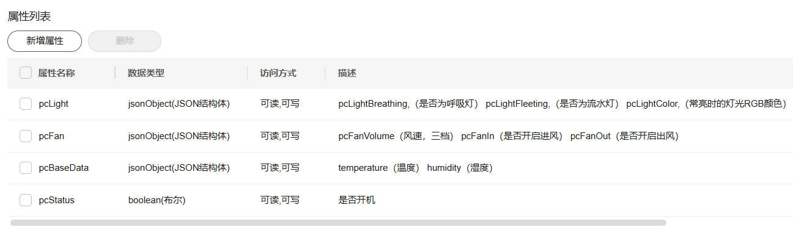
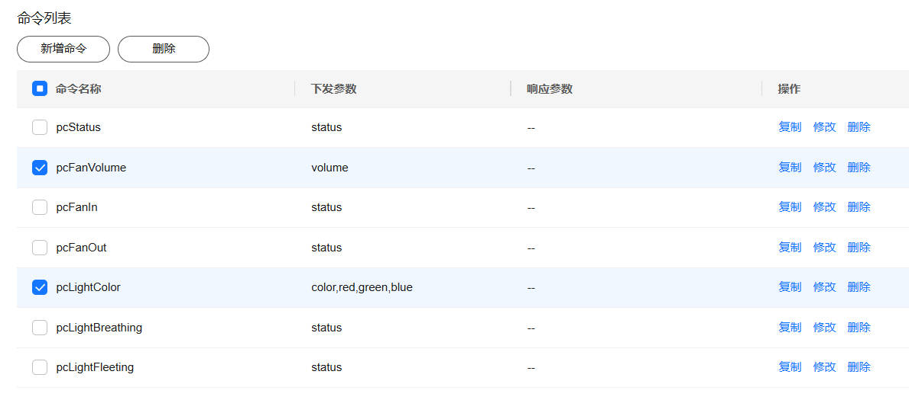
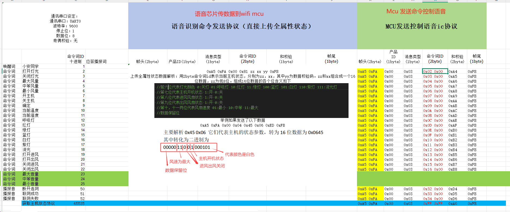
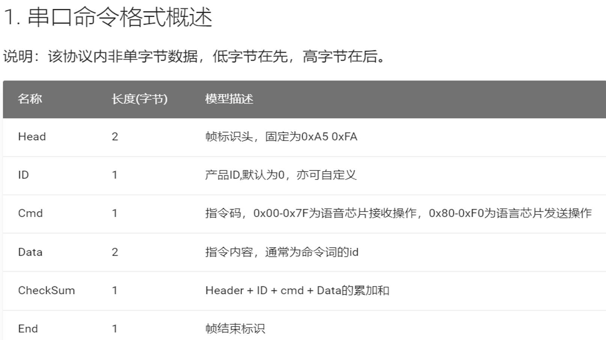

# esp32c2端对接文档

## 烧录说明

- 前往下载 [Flash Download Tool](https://bbs.espressif.com/viewtopic.php?f=57&t=433) 烧录工具，选择`ESP32-C2`，按照图中的`SPIFlashConfig`进行配置（注意`SPI SPEED`是`26.7MHz`），随后将合并好的`.bin`文件进行在地址`0x00`直接进行烧录即可。稍等片刻，芯片会等待配网，此时如果看到芯片的热点名称，即视为烧录成功且程序成功运行


## WIFI：

1. （已弃用）进行wifi连接，暂时使用本地wifi测试（小程序配网后续完善），
```c
    #define WIFI_SSID "odddouglas"     // Wi-Fi SSID
    #define WIFI_PASSWORD "odddouglas" // Wi-Fi 密码
```
2. （需要官方app的softap配网工具）进行配网
```c
    const char *service_name = "SMARTHOST_PROV";
    const char *service_key = "abcd1234"; // SoftAP 密码
    const char *pop = "abcd1234";         // Proof of possession
```
- 前往下载 [softap 官方配网工具app](https://github.com/espressif/esp-idf-provisioning-android)，官方同时提供`ios`,`Android`的版本，可根据开源仓库代码进行复刻

  该工具的使用流程就是`Provision New Device`->`i don't have a QR code`->`Connect`->`连接芯片热点`->`选择对应wifi填入信息`->`等待配网响应成功即可`。需要注意的是，第一次配网成功之后，之后esp将会自动连接配置好的wifi而无需再次配网（后续可进行设置，比如用户希望更换网络）

## SOFTAP：

前往开源配网软件源代码 [SoftAPTransport.java](https://github.com/espressif/esp-idf-provisioning-android/blob/master/provisioning/src/main/java/com/espressif/provisioning/transport/SoftAPTransport.java)，中，HTTP 请求的核心流程体现在如下方法里：

- `sendPostRequest(String path, byte[] data, ResponseListener listener)`
  负责构造并发送 HTTP POST 请求到指定 path（如 `prov-session`, `prov-scan` 等），并处理服务器（ESP 设备）响应。

- `sendConfigData(String path, byte[] data, ResponseListener listener)`
  对外暴露接口，实际通过线程池异步调用 `sendPostRequest` 完成配网通信。

  看到 java 代码片段如下（省略部分内容）：

```java
URL url = new URL("http://" + baseUrl + "/" + path);
HttpURLConnection urlConnection = (HttpURLConnection) url.openConnection();
urlConnection.setRequestMethod("POST");
urlConnection.setRequestProperty("Accept", "text/plain");
urlConnection.setRequestProperty("Content-type", "application/x-www-form-urlencoded");
...
OutputStream os = urlConnection.getOutputStream();
os.write(data);
os.close();
```

其中 `baseUrl` 会配置为设备的 mDNS 地址，比如 `wifi-prov.local`。而esp默认的官方地址为`192.168.4.1`，这一点在esp的调试终端中可以看到

```bash
2025-06-04 20:22:23 I (1288) esp_netif_lwip: DHCP server started on interface WIFI_AP_DEF with IP: 192.168.4.1
```

- 当设备连接上之后，设备端分配到IP地址。此时就可以进行http的访问请求了

```bash
2025-06-04 21:11:57 I (2974568) wifi:station: 8c:c6:81:9a:bb:18 join, AID=1, bgn, 20
2025-06-04 21:11:57 I (2974848) esp_netif_lwip: DHCP server assigned IP to a client, IP is: 192.168.4.2
```

- 而ESP 侧的 protocomm 实现要求所有 POST 请求必须有 `Content-Length` 字段（哪怕 body 为空）。

```bash
curl -v -X POST -H "Content-Type: application/json" -d '' http://192.168.4.1/proto-ver
```

- 连接后，客户端应用程序可以立即从 `proto-ver` 端点获取版本或功能信息。所有与此端点的通信均未加密，因此在建立安全会话之前，可以检索相关必要信息，确保会话兼容。响应数据采用 JSON 格式，示例如下：`prov: { ver: v1.1, sec_ver: 1, sec_patch_ver: 0, cap: [no_pop] }, my_app: { ver: 1.345, cap: [cloud, local_ctrl] },....`。此时在终端进行访问成功之后，终端信息如下所示，拿到了`prov`的json文本标签即视为成功。

```bash
Note: Unnecessary use of -X or --request, POST is already inferred.
*   Trying 192.168.4.1:80...
* Connected to 192.168.4.1 (192.168.4.1) port 80
* using HTTP/1.x
> POST /proto-ver HTTP/1.1
> Host: 192.168.4.1
> User-Agent: curl/8.12.1
> Accept: */*
> Content-Type: application/json
> Content-Length: 2
>
* upload completely sent off: 2 bytes
< HTTP/1.1 200 OK
< Content-Type: text/html
< Content-Length: 73
< Set-Cookie: session=2252508986
<
{
        "prov": {
                "ver":  "v1.1",
                "sec_ver":      1,
                "cap":  ["wifi_scan"]
        }
}* Connection #0 to host 192.168.4.1 left intact

```

- 随后对该数据包进行解析即可，连接到 ESP 设备的热点，确保已经连接上 ESP 设备开启的 Wi-Fi 热点（SoftAP）。访问以下 HTTP 端点，具体的客户端实现步骤请跳转到 [##MINIPROGRAM](##MINIPROGRAM) 

> 获取版本信息：
> http://192.168.4.1/proto-ver
> 建立会话：
> http://192.168.4.1/prov-session
> 启动 Wi-Fi 扫描：
> http://192.168.4.1/prov-scan
> 配置 Wi-Fi 凭据：
> http://192.168.4.1/prov-config

## MQTT：

- IOT端的属性列表，命令列表
- 以下三元组等信息仅供参考（本人用的自己的账户进行测试）

```c
    #define MQTT_ADDRESS "mqtt://e5e7404266.st1.iotda-device.cn-north-4.myhuaweicloud.com:1883"
    #define MQTT_CLIENFID "67fe4c765367f573f7830638_esp32_0_0_2025051303"
    #define MQTT_USERNAME "67fe4c765367f573f7830638_esp32"
    #define MQTT_PASSWORD "beb57fa257b6fc3dc92d71a515d059d0788640a6f17b82c78860c18c5fde50ff"
    #define DEVICE_ID "67fe4c765367f573f7830638_esp32"
    #define SERVER_ID "gateway_data"
    #define MQTT_TOPIC_REPORT "$oc/devices/" DEVICE_ID "/sys/properties/report"
    #define MQTT_TOPIC_COMMAND "$oc/devices/" DEVICE_ID "/sys/commands/#"
    #define MQTT_TOPIC_COMMAND_RESPOND "$oc/devices/" DEVICE_ID "/sys/commands/response/request_id="
```




```bash
    //数据格式参考
    pcLight:{"pcLightBreathing":false,"pcLightFleeting":false,"pcLightColor":"white"}
    pcFan:{"pcFanVolume":"high","pcFanIn":true,"pcFanOut":true}
    pcBaseData:{"temperature":0,"humidity":0}
    pcStatus:1
```

## BLE：

- 广播之后，等待连接（不影响MQTT线程），连接之后，此时语音芯片一旦作答，在MQTT上报的同时，也会向小程序发送类似`0xA5 0xFA 0x00 0x81 0xC7 0x07 0xEE 0xFB`的数据包。表示`主机:1 呼吸:0 流光:1 颜色: 风扇IN:1 OUT:1 风速:high` 

```c
    // 数据格式
    static uint8_t sv1_char1_value[8] = {0x00, 0x00, 0x00, 0x00, 0x00, 0x00, 0x00, 0x00};
    static uint8_t sv1_char2_value[8] = {0x00, 0x00, 0x00, 0x00, 0x00, 0x00, 0x00, 0x00};
    
    // 发送通知部分
    esp_ble_gatts_set_attr_value(sv1_handle_table[SV1_CH1_IDX_CHAR_VAL], length, sv1_char1_value);
    esp_ble_gatts_send_indicate(gl_gatts_if, gl_conn_id, sv1_handle_table[SV1_CH1_IDX_CHAR_VAL], length, sv1_char1_value, false);
    ESP_LOGI(TAG, "通知特征1: 数据长度 = %d, 数据内容:", length);
    esp_log_buffer_hex(TAG, sv1_char1_value, length);
```

## MINIPROGRAM：

- 蓝牙接收端示例解析，蓝牙监听到ArrayBuffer格式数据包，可以转换成十六进制的字符串之后进行解析（根据对接文档）
```ts
// 将 ArrayBuffer 转换为十六进制字符串
function ab2hex(buffer) {
    const hexArr = Array.prototype.map.call(
        new Uint8Array(buffer),
        bit => ('00' + bit.toString(16)).slice(-2)
    );
    return hexArr.join(' ');
}   
// 接收蓝牙特征值变化事件
wx.onBLECharacteristicValueChange(characteristic => {
    console.log("收到原始的数据", characteristic, characteristic.value);
    const receivedData = ab2hex(characteristic.value); // 转换为字符串
    console.log("接收到的数据", receivedData);
    parseReceivedData(page, receivedData);
});

```

- 蓝牙发送端示例解析：蓝牙将十六进制的字符串数据包直接转换成ArrayBuffer格式下发给设备端，向设备端发送`"a5 fa 00 03 12 00 b8 fb"`这样的命令数据包即可。

```js
// 发送这样的字符串数据即可
const dataToSend = "a5 fa 00 03 12 00 b8 fb"; // 示例数据
bluetooth.writeBLECharacteristicValue(this, dataToSend);
```

```ts
// 将十六进制字符串转换为 ArrayBuffer
function hex2ab(hexStr) {
    hexStr = hexStr.replace(/\s+/g, ''); // 去掉可能的空格
    const buffer = new ArrayBuffer(hexStr.length / 2);
    const dataView = new Uint8Array(buffer);
    for (let i = 0; i < hexStr.length; i += 2) {
        dataView[i / 2] = parseInt(hexStr.substr(i, 2), 16);
    }
    return buffer;
}
// 发送数据到蓝牙设备
function writeBLECharacteristicValue(page, jsonStr) {
    let arrayBufferValue = hex2ab(jsonStr); // 转换为 ArrayBuffer
    console.log("发送数据给蓝牙", "原始字符串", jsonStr, "转换arrayBuffer", arrayBufferValue);

    wx.writeBLECharacteristicValue({
        deviceId: page._deviceId,
        serviceId: page._serviceId,
        characteristicId: page._characteristicId,
        value: arrayBufferValue,
        success(res) {
            console.log("消息发送成功", res.errMsg);
        },
        fail(e) {
            console.log("发送消息失败", e);
        },
    });
}
```
- softap配网相关http逻辑：在原生框架中，有一段提示。`typings\types\wx\lib.wx.api.d.ts`中

```ts
* 发起 HTTPS 网络请求。使用前请注意阅读[相关说明](https://developers.weixin.qq.com/miniprogram/dev/framework/ability/network.html)。
*
* **data 参数说明**
*
*
* 最终发送给服务器的数据是 String 类型，如果传入的 data 不是 String 类型，会被转换成 String 。转换规则如下：
* - 对于 `GET` 方法的数据，会将数据转换成 query string（`encodeURIComponent(k)=encodeURIComponent(v)&encodeURIComponent(k)=encodeURIComponent(v)...`）
* - 对于 `POST` 方法且 `header['content-type']` 为 `application/json` 的数据，会对数据进行 JSON 序列化
* - 对于 `POST` 方法且 `header['content-type']` 为 `application/x-www-form-urlencoded` 的数据，会将数据转换成 query string `（encodeURIComponent(k)=encodeURIComponent(v)&encodeURIComponent(k)=encodeURIComponent(v)...）`
*
```
- 具体的HTTP端点情况请跳转到[##SOFTAP](##SOFTAP) 


```ts
wx.request({
  url: 'http://192.168.4.1/proto-ver',
  method: 'POST',
  header: {
    'Content-Type': 'application/json' //请求头
  },
  data: '{}', // 发送空j字符串，确保 Content-Length: 0
  success: function(res) {
    console.log('请求成功：', res.data);
  },
  fail: function(err) {
    console.error('请求失败：', err);
  }
});
```
## UART：

- `TX(IO1)`，`RX(IO3)`，这是负责收发语音芯片数据的串口NUM1，另一个串口负责打印信息，esp32c2的系列的默认串口0有所区别。已完成收发，对语音芯片的数据进行解析并上传，同时接收云端命令下发并解析发给语音芯片完成控制
```c
    #define UART_PORT_NUM UART_NUM_1
    #define UART_BAUD_RATE 9600
    #define UART_TX_PIN 1
    #define UART_RX_PIN 3
    #define BUF_SIZE 1024
    #define FRAME_LEN 8
    #define MAX_FRAME_ERRORS 5
```

- 连接示意图如下，在板子上找到`PB6`和`PB5`，分别连接espc2的`IO1`和`IO3`，c2的默认串口`RX0`和`TX0`专门烧录（集成开发板就直接用usb进行烧录即可）


## HW_TIMER：

- 进行简单的定时全属性上报（统一），目前mqtt的上报是使用差量上传（语音芯片响应之后，将发生变化的属性进行上报），目前设置的是120s上传一次，避免影子数据遗留问题。

```c
      #define TIMER_GROUP TIMER_GROUP_0
      #define TIMER_IDX TIMER_0
      #define TIMER_INTERVAL_SEC 120 // 120 秒周期
```

# esp-idf框架

```bash
esp32c2/
├── .devcontainer/
├── .gitignore
├── .vscode/
├── CMakeLists.txt
├── README.md
├── sdkconfig
├── sdkconfig.old
├── build/
│   ├── main.bin    # 编译生成的二进制文件，可使用 flash 工具烧录
├── partitions.csv  # 自定义flash分区表，目前设置仅支持两个栈大小为2048的任务执行
├── main/
│   ├── main.c
|   ├── main.h     # 主模块的头文件（如全局变量声明等）
│   └── CMakeLists.txt
├── components/    # 自定义组件（Component）目录，自行添加需要补充main/Cmake链接
│   ├── bsp_ble/  # BLE 功能模块
│   │   ├── bsp_ble.c
│   │   ├── CMakeLists.txt
│   │   └── include/
│   │       └── bsp_ble.h  # BLE 公共头文件（供外部引用，一般在这些组件里修改一些全局变量）
│   ├── bsp_hw_timer/ # 硬件定时器模块
│   │   ├── bsp_hw_timer.c
│   │   ├── CMakeLists.txt
│   │   └── include/
│   │       └── bsp_hw_timer.h
│   ├── bsp_mqtt/ # MQTT 通信模块 
│   │   ├── bsp_mqtt.c
│   │   ├── CMakeLists.txt
│   │   └── include/
│   │       └── bsp_mqtt.h
│   ├── bsp_uart/ # UART 串口通信模块 IO3
│   │   ├── bsp_uart.c
│   │   ├── CMakeLists.txt
│   │   └── include/
│   │       └── bsp_uart.h
│   └── bsp_wifi/  # Wi-Fi 连接模块
│       ├── bsp_wifi.c
│       ├── CMakeLists.txt
│       └── include/
│           └── bsp_wifi.h
```

# arduino框架（弃用，ble_mesh编译链缺失，官方暂时未支持该框架下的ble开发）

```bash
esp32c2/
├── build/
│   └── esp32.esp32.esp32c2/        # 编译生成的二进制文件目录，可使用 flash 工具烧录
│       ├── esp32c2.ino.bin              # 程序主固件二进制文件
│       ├── esp32c2.ino.bootloader.bin   # 启动加载程序二进制文件
│       ├── esp32c2.ino.elf               # 可执行文件，包含调试信息
│       ├── esp32c2.ino.map               # 内存映射文件，调试用
│       ├── esp32c2.ino.merged.bin        # 合并后的完整固件二进制文件
│       └── esp32c2.ino.partitions.bin    # flash 分区表二进制文件
├── esp32c2.ino                      # Arduino 主程序入口文件
├── libraries/                     
│   ├── Adafruit_Unified_Sensor/     # 传感器统一库
│   ├── ArduinoJson/                  # JSON 解析库
│   ├── NimBLE-Arduino/               # 轻量级 BLE 库
│   ├── PubSubClient/                 # MQTT 客户端库
│   └── WiFiManager/                  # WiFi 管理库，自动连接配置
```


# 对接协议




